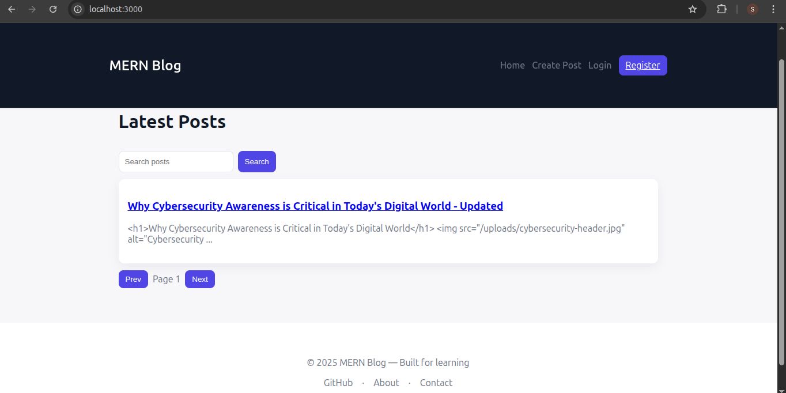

This repository contains a full-stack MERN (MongoDB, Express, React, Node) blog application used for Week 4 assignment: a simple blog platform with authentication, categories, post creation (with image uploads), and basic post views.

## Project overview

- Backend: Node.js + Express API with MongoDB (Mongoose) models for Users, Posts and Categories. Supports JWT authentication and file uploads for featured images.
- Frontend: React (Vite) single-page app with routes for listing posts, viewing a single post, and creating/editing posts. Client uses axios for API communication and localStorage for token persistence.

This project demonstrates typical full-stack integration features such as protected API routes, multipart file uploads, client-side form handling, and optimistic state updates.

## Quick links

- Server code: `server/`
- Client code: `client/`
- Database models: `server/models/`
- Scripts: `server/scripts/` (helper scripts used during testing)
- Screenshots: `screenshots/` (images of the app UI)

---

## Setup instructions

Requirements:
- Node.js v16+ (recommended v18+)
- MongoDB running locally or accessible via connection string

Steps:

1. Clone the repository

   git clone <your-repo-url>
   cd mern-stack-integration-Moniah-code

2. Server setup

   cd server
   npm install

   Create a `.env` in `server/` (copy `.env.example` if present) and set:

   MONGODB_URI=mongodb://127.0.0.1:27017/mern_blog
   PORT=5000
   JWT_SECRET=your_jwt_secret_here

   Start server (development):

   npm run dev

3. Client setup

   cd ../client
   npm install

   If using Vite, configure `VITE_API_URL` in `.env` or rely on default `http://localhost:5000/api/v1`.

   Start client (development):

   npm run dev

4. Use the application

- Register a user (or use provided credentials in tests)
- Login, create categories, create and edit posts, upload featured images

---

## API documentation

Base URL: `http://localhost:5000/api/v1`

Authentication: JWT in `Authorization: Bearer <token>` header. Login returns `{ user, token }`.

Endpoints (summary):

- Auth
  - POST /auth/register — Register a new user. Body: `{ name, email, password }`. Returns user + token.
  - POST /auth/login — Login user. Body: `{ email, password }`. Returns user + token.

- Categories
  - GET /categories — List all categories.
  - POST /categories — Create a new category (protected). Body: `{ name, description }`.

- Posts
  - GET /posts?page=&limit=&category=&q= — List posts with pagination/search.
  - GET /posts/:idOrSlug — Get a single post by id or slug.
  - POST /posts — Create a post (protected). Accepts `multipart/form-data` for `featuredImage`. Required fields: `title`, `content`, `category`. Optional: `tags` (array or JSON string), `excerpt`, `isPublished`.
  - PUT /posts/:id — Update a post (protected, author-only). Accepts `multipart/form-data` when updating `featuredImage`.
  - DELETE /posts/:id — Delete a post (protected, author-only).
  - POST /posts/:id/comments — Add a comment (protected). Body: `{ content }`.

Notes:
- When creating/updating posts with an image, send `featuredImage` as part of `multipart/form-data` and other fields as form fields. Tags can be sent as a JSON string.
- Protected routes require an Authorization header: `Authorization: Bearer <token>`.

---

## Features implemented

- User authentication with JWT (register & login)
- Protected routes for creating/updating/deleting posts and categories
- Category management (create & list)
- Create/edit posts with support for rich HTML content
- Image upload for featured images (server saves under `server/uploads` and serves them statically)
- Post search and pagination
- Post comments and view count increment
- Basic UI components: Post list, single post view, create/edit form, category manager

---

## Screenshots

The `screenshots/` folder contains snapshots of the UI. Reference them below (they are included in the repo):

- `screenshots/Home.jpg` — Home / posts listing
- `screenshots/Dashboard.jpg` — Admin / dashboard view
- `screenshots/Login.jpg` — Login screen
- `screenshots/Register.jpg` — Register screen
- `screenshots/PostCreation.jpg` — Post creation form (image upload)

You can preview these directly from the repository or include them in other documentation. Example markdown to show an image:



---

## Development notes & troubleshooting

- If you see `Token is not valid`, confirm `JWT_SECRET` in server `.env` matches the secret used to sign tokens. Restart the server after changing env vars.
- Uploads are served from: `http://localhost:5000/uploads/<filename>` when server is running.
- If images do not appear in the frontend, check the `featuredImage` field on the post object (it should point to `/uploads/<filename>`).

## Contributing

This repository was created as a class assignment. Feel free to open PRs or suggest improvements.

---

## License

MIT

Quick start

1. Server

```bash
cd server
cp .env.example .env
# Edit .env to point to your MongoDB (e.g. mongodb://localhost:27017/mern_blog)
npm install
npm run dev
```

2. Client

```bash
cd client
npm install
npm run dev
```

The Vite dev server proxies `/api` to `http://localhost:5000` by default.

Notes
- Create an initial category using the API or via a quick curl/post to `/api/categories` (requires auth).
- Register via `/api/auth/register` to obtain a token; save it to localStorage as `token` (the client will handle auth in `client/src/services/api.js`).

What's included
- Models: `server/models/Post.js`, `server/models/Category.js`, `server/models/User.js`
- Routes: `server/routes/posts.js`, `server/routes/categories.js`, `server/routes/auth.js`
- Client: `client/src` with components for listing, viewing, creating posts and comments.
# MERN Stack Integration Assignment

This assignment focuses on building a full-stack MERN (MongoDB, Express.js, React.js, Node.js) application that demonstrates seamless integration between front-end and back-end components.

## Assignment Overview

You will build a blog application with the following features:
1. RESTful API with Express.js and MongoDB
2. React front-end with component architecture
3. Full CRUD functionality for blog posts
4. User authentication and authorization
5. Advanced features like image uploads and comments

## Project Structure

```
mern-blog/
├── client/                 # React front-end
│   ├── public/             # Static files
│   ├── src/                # React source code
│   │   ├── components/     # Reusable components
│   │   ├── pages/          # Page components
│   │   ├── hooks/          # Custom React hooks
│   │   ├── services/       # API services
│   │   ├── context/        # React context providers
│   │   └── App.jsx         # Main application component
│   └── package.json        # Client dependencies
├── server/                 # Express.js back-end
│   ├── config/             # Configuration files
│   ├── controllers/        # Route controllers
│   ├── models/             # Mongoose models
│   ├── routes/             # API routes
│   ├── middleware/         # Custom middleware
│   ├── utils/              # Utility functions
│   ├── server.js           # Main server file
│   └── package.json        # Server dependencies
└── README.md               # Project documentation
```

## Getting Started

1. Accept the GitHub Classroom assignment invitation
2. Clone your personal repository that was created by GitHub Classroom
3. Follow the setup instructions in the `Week4-Assignment.md` file
4. Complete the tasks outlined in the assignment

Local environment variables
---------------------------
Create a local `.env` file for the server to point to your MongoDB instance. Copy `server/.env.example` or create `server/.env` with values such as:

```
MONGODB_URI=mongodb://127.0.0.1:27017/project3DB
PORT=5000
JWT_SECRET=your_jwt_secret_here
NODE_ENV=development
```

After creating the `.env` file, restart the server so it picks up the values.

## Files Included

- `Week4-Assignment.md`: Detailed assignment instructions
- Starter code for both client and server:
  - Basic project structure
  - Configuration files
  - Sample models and components

## Requirements

- Node.js (v18 or higher)
- MongoDB (local installation or Atlas account)
- npm or yarn
- Git

## Submission

Your work will be automatically submitted when you push to your GitHub Classroom repository. Make sure to:

1. Complete both the client and server portions of the application
2. Implement all required API endpoints
3. Create the necessary React components and hooks
4. Document your API and setup process in the README.md
5. Include screenshots of your working application

## Resources

- [MongoDB Documentation](https://docs.mongodb.com/)
- [Express.js Documentation](https://expressjs.com/)
- [React Documentation](https://react.dev/)
- [Node.js Documentation](https://nodejs.org/en/docs/)
- [Mongoose Documentation](https://mongoosejs.com/docs/) 